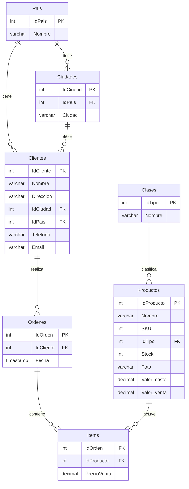

# Plan de Implementación - Backend E-commerce
## Parte 1: Base de Datos MySQL en Red Hat 9

### 📋 Información del Servidor
- **IP**: 10.242.64.5
- **SO**: Red Hat Enterprise Linux 9
- **Base de Datos**: MySQL (última versión estable desde repositorios oficiales de Red Hat)
- **Acceso**: SSH con usuario sudo

---

## 🏗️ Arquitectura de Base de Datos

### Diagrama de Relaciones



---

## 📊 Estructura de Tablas Detallada

### 1. Tabla: Pais
```sql
- IdPais: INT AUTO_INCREMENT PRIMARY KEY
- Nombre: VARCHAR(50) NOT NULL
```
**Datos iniciales**: 5 países (Argentina, Chile, Uruguay, Paraguay, Brasil)

### 2. Tabla: Ciudades
```sql
- IdCiudad: INT AUTO_INCREMENT PRIMARY KEY
- IdPais: INT NOT NULL (FK -> Pais.IdPais)
- Ciudad: VARCHAR(50) NOT NULL
```
**Datos iniciales**: 10 ciudades principales por país (50 total)

### 3. Tabla: Clientes
```sql
- IdCliente: INT AUTO_INCREMENT PRIMARY KEY
- Nombre: VARCHAR(50) NOT NULL
- Direccion: VARCHAR(50)
- IdCiudad: INT NOT NULL (FK -> Ciudades.IdCiudad)
- IdPais: INT NOT NULL (FK -> Pais.IdPais)
- Telefono: VARCHAR(20)
- Email: VARCHAR(50)
```

### 4. Tabla: Clases
```sql
- IdTipo: INT AUTO_INCREMENT PRIMARY KEY
- Nombre: VARCHAR(50) NOT NULL
```
**Datos iniciales**: 20 tipos de productos comunes

### 5. Tabla: Productos
```sql
- IdProducto: INT AUTO_INCREMENT PRIMARY KEY
- Nombre: VARCHAR(50) NOT NULL
- SKU: INT UNIQUE NOT NULL
- IdTipo: INT NOT NULL (FK -> Clases.IdTipo)
- Stock: INT DEFAULT 0
- Foto: VARCHAR(500) (URL de imagen)
- Valor_costo: DECIMAL(10,2) NOT NULL
- Valor_venta: DECIMAL(10,2) NOT NULL
```
**Datos iniciales**: 50 productos con imágenes de internet

### 6. Tabla: Ordenes
```sql
- IdOrden: INT AUTO_INCREMENT PRIMARY KEY
- IdCliente: INT NOT NULL (FK -> Clientes.IdCliente)
- Fecha: TIMESTAMP DEFAULT CURRENT_TIMESTAMP
```

### 7. Tabla: Items
```sql
- IdOrden: INT NOT NULL (FK -> Ordenes.IdOrden)
- IdProducto: INT NOT NULL (FK -> Productos.IdProducto)
- PrecioVenta: DECIMAL(10,2) NOT NULL
- PRIMARY KEY (IdOrden, IdProducto)
```

---

## 🔒 Reglas de Integridad Referencial

### Restricciones ON DELETE
1. **Pais**: `RESTRICT` - No puede eliminarse si tiene ciudades o clientes asociados
2. **Ciudades**: `RESTRICT` - No puede eliminarse si tiene clientes asociados
3. **Clases**: `RESTRICT` - No puede eliminarse si tiene productos asociados
4. **Clientes**: `CASCADE` en Ordenes - Al eliminar cliente, se eliminan sus órdenes
5. **Ordenes**: `CASCADE` en Items - Al eliminar orden, se eliminan sus items
6. **Productos**: `RESTRICT` - No puede eliminarse si está en items de órdenes

### Validaciones
- IdPais y IdCiudad en Clientes deben existir en sus respectivas tablas
- IdTipo en Productos debe existir en Clases
- Stock no puede ser negativo
- Valor_costo y Valor_venta deben ser positivos
- Email debe tener formato válido

---

## 📦 Datos Iniciales

### Países (5)
1. Argentina
2. Chile
3. Uruguay
4. Paraguay
5. Brasil

### Ciudades (10 por país)

**Argentina**: Buenos Aires, Córdoba, Rosario, Mendoza, La Plata, San Miguel de Tucumán, Mar del Plata, Salta, Santa Fe, San Juan

**Chile**: Santiago, Valparaíso, Concepción, La Serena, Antofagasta, Temuco, Rancagua, Talca, Arica, Puerto Montt

**Uruguay**: Montevideo, Salto, Paysandú, Las Piedras, Rivera, Maldonado, Tacuarembó, Melo, Mercedes, Artigas

**Paraguay**: Asunción, Ciudad del Este, San Lorenzo, Luque, Capiatá, Lambaré, Fernando de la Mora, Limpio, Ñemby, Encarnación

**Brasil**: São Paulo, Rio de Janeiro, Brasília, Salvador, Fortaleza, Belo Horizonte, Manaus, Curitiba, Recife, Porto Alegre

### Clases de Productos (20)
1. Electrónica
2. Indumentaria
3. Electrodomésticos
4. Productos de Belleza
5. Deportes y Fitness
6. Hogar y Decoración
7. Juguetes y Juegos
8. Libros y Papelería
9. Alimentos y Bebidas
10. Salud y Cuidado Personal
11. Automotriz
12. Herramientas y Ferretería
13. Mascotas
14. Bebés y Niños
15. Música e Instrumentos
16. Jardín y Exterior
17. Oficina
18. Tecnología Wearable
19. Gaming
20. Fotografía y Video

### Productos (50 ejemplos con precios estimados ARS)

**Electrónica**:
- PlayStation 5 (SKU: 1001) - Costo: 490,000 / Venta: 700,000
- Nintendo Switch 2 (SKU: 1002) - Costo: 350,000 / Venta: 500,000
- iPhone 15 Pro (SKU: 1003) - Costo: 910,000 / Venta: 1,300,000

**Indumentaria**:
- Zapatillas Nike Air Max (SKU: 2001) - Costo: 105,000 / Venta: 150,000
- Zapatillas Reebok Classic (SKU: 2002) - Costo: 70,000 / Venta: 100,000

**Productos de Belleza**:
- Set Makeup MAC (SKU: 4001) - Costo: 35,000 / Venta: 50,000
- Perfume Chanel N°5 (SKU: 4002) - Costo: 140,000 / Venta: 200,000

*(Continúa con 43 productos más distribuidos en las 20 categorías)*

---

## 🚀 Plan de Implementación

### Fase 1: Instalación y Configuración
1. Instalar MySQL desde repositorios oficiales de Red Hat
2. Configurar MySQL para acceso remoto seguro
3. Crear usuario de base de datos para la aplicación
4. Configurar firewall para puerto 3306

### Fase 2: Creación de Estructura
1. Crear base de datos `ecommerce`
2. Ejecutar script DDL para crear todas las tablas
3. Crear índices para optimización
4. Configurar constraints y foreign keys

### Fase 3: Carga de Datos Iniciales
1. Insertar países
2. Insertar ciudades
3. Insertar clases de productos
4. Insertar productos con URLs de imágenes

### Fase 4: Validación
1. Verificar integridad referencial
2. Probar restricciones de eliminación
3. Validar conectividad remota
4. Ejecutar queries de prueba

---

## 📝 Scripts a Crear

1. **install_mysql.sh** - Instalación de MySQL en RHEL 9
2. **configure_mysql.sh** - Configuración de acceso remoto
3. **01_create_database.sql** - Creación de base de datos y tablas
4. **02_seed_data.sql** - Datos iniciales (países, ciudades, clases, productos)
5. **03_create_indexes.sql** - Índices para optimización
6. **04_test_queries.sql** - Queries de validación
7. **README.md** - Documentación de instalación paso a paso

---

## 🔗 Conectividad con Middleware

### Información de Conexión
- **Host**: 10.242.64.5
- **Puerto**: 3306
- **Base de Datos**: ecommerce
- **Usuario**: ecommerce_user (a crear)
- **Charset**: utf8mb4
- **Collation**: utf8mb4_unicode_ci

### Endpoints que el Middleware Deberá Implementar
- GET /api/paises
- GET /api/ciudades/{idPais}
- GET /api/clientes
- POST /api/clientes
- GET /api/productos
- GET /api/productos/{idTipo}
- POST /api/ordenes
- GET /api/ordenes/{idCliente}

---

## ⚠️ Consideraciones de Seguridad

1. Usuario de base de datos con permisos limitados (no root)
2. Conexiones solo desde IP del middleware
3. Contraseñas seguras
4. SSL/TLS para conexiones remotas (opcional pero recomendado)
5. Backup automático configurado
6. Logs de auditoría habilitados

---

## 📊 Estimación de Almacenamiento

- Países: ~5 registros
- Ciudades: ~50 registros
- Clases: ~20 registros
- Productos: ~50 registros iniciales (crecimiento esperado)
- Clientes: Crecimiento según uso
- Órdenes e Items: Crecimiento según transacciones

**Espacio inicial estimado**: < 1 MB
**Espacio recomendado**: 10 GB para crecimiento

---

## ✅ Criterios de Aceptación

- [ ] MySQL instalado desde repositorios oficiales de Red Hat
- [ ] Base de datos `ecommerce` creada
- [ ] Todas las 7 tablas creadas con estructura correcta
- [ ] 5 países insertados
- [ ] 50 ciudades insertadas (10 por país)
- [ ] 20 clases de productos insertadas
- [ ] 50 productos insertados con URLs de imágenes válidas
- [ ] Todas las foreign keys funcionando correctamente
- [ ] Restricciones de eliminación validadas
- [ ] Conectividad remota desde middleware funcionando
- [ ] Usuario de aplicación creado con permisos apropiados
- [ ] Documentación completa de instalación

---

## 🔄 Próximos Pasos (Parte 2 y 3)

**Parte 2 - Middleware (Quarkus)**:
- APIs RESTful para CRUD de todas las entidades
- Conexión a MySQL usando JDBC
- Validaciones de negocio
- Manejo de transacciones

**Parte 3 - Frontend (React)**:
- Interfaz de usuario para gestión de clientes
- Catálogo de productos
- Carrito de compras
- Gestión de órdenes