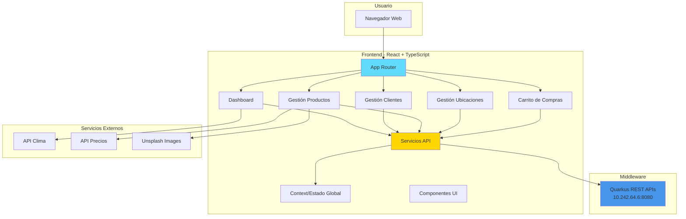
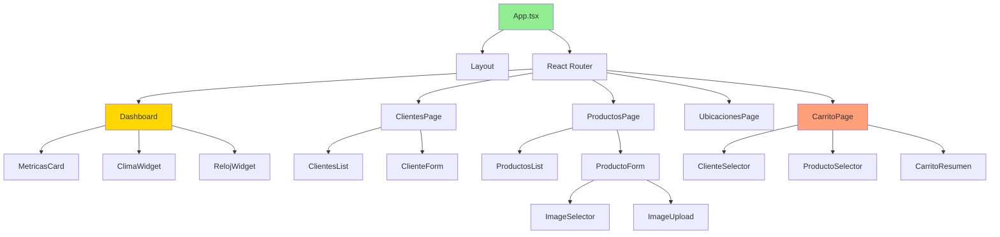
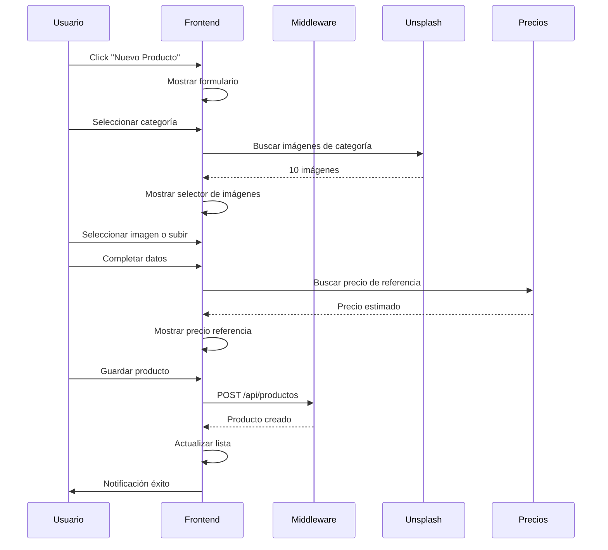
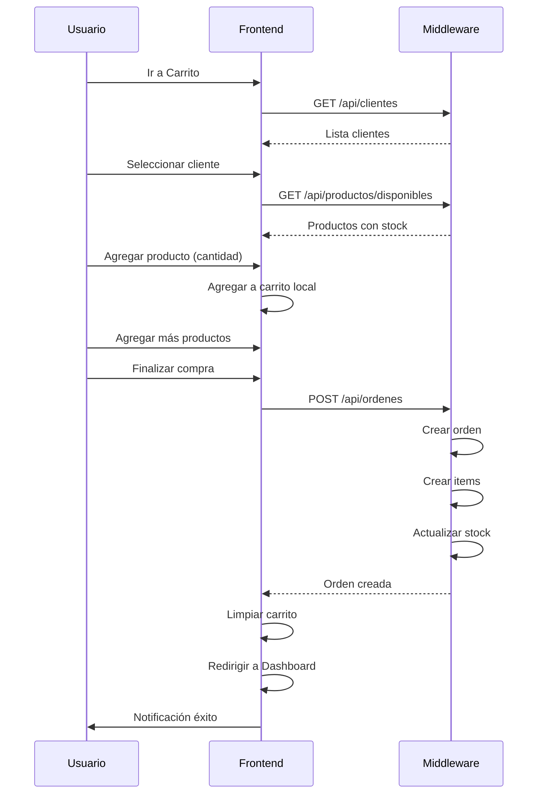

# Plan de Implementación - Frontend React + TypeScript
## Parte 3: Aplicación Web E-commerce

### 📋 Información del Servidor
- **IP**: 10.242.64.7
- **Puerto**: 3000
- **SO**: Red Hat Enterprise Linux 9
- **Framework**: React 18 + TypeScript 5
- **Build Tool**: Vite
- **UI Library**: Material-UI (MUI)
- **Acceso**: SSH con usuario sudo

---

## 🏗️ Arquitectura del Frontend



---

## 📊 Estructura de Componentes



---

## 🎯 Funcionalidades Principales

### 1. Dashboard Principal

**Métricas a Mostrar:**
- 📊 Cantidad total de clientes
- 📦 Cantidad total de productos
- 💰 Valuación del stock (valor de compra)
- 💵 Valuación del stock (valor de venta)
- 🌡️ Clima actual en Argentina (temperatura, condición)
- 🕐 Hora actual
- 📈 Gráficos de productos por categoría
- 🛒 Últimas órdenes realizadas

**Fuentes de Datos:**
- Métricas: API Middleware
- Clima: wttr.in (servicio gratuito sin API key)
- Hora: JavaScript Date API

### 2. Gestión de Clientes

**Funcionalidades:**
- ✅ Listar todos los clientes
- ✅ Crear nuevo cliente
- ✅ Editar cliente existente
- ✅ Eliminar cliente
- ✅ Buscar/filtrar clientes
- ✅ Validación de formularios
- ✅ Selección de país y ciudad

**Campos del Formulario:**
- Nombre (requerido)
- Dirección
- País (select)
- Ciudad (select dependiente del país)
- Teléfono
- Email (validación)

### 3. Gestión de Productos

**Funcionalidades:**
- ✅ Listar todos los productos
- ✅ Crear nuevo producto
- ✅ Editar producto existente
- ✅ Eliminar producto
- ✅ Filtrar por categoría
- ✅ Filtrar por disponibilidad
- ✅ Selector de imágenes predefinidas
- ✅ Upload de imagen personalizada
- ✅ Precio de referencia de mercado

**Selector de Imágenes:**
- Al seleccionar categoría, mostrar 10 imágenes sugeridas
- Imágenes obtenidas de Unsplash API (gratuita)
- Opción de subir imagen propia
- Preview de imagen seleccionada

**Campos del Formulario:**
- Nombre (requerido)
- SKU (único, requerido)
- Categoría (select)
- Stock (número)
- Imagen (selector + upload)
- Valor de costo (número)
- Valor de venta (número)
- Precio de referencia (obtenido automáticamente)

### 4. Gestión de Ubicaciones

**Países:**
- Listar países
- Crear país
- Editar país
- Eliminar país (si no tiene ciudades/clientes)

**Ciudades:**
- Listar ciudades
- Filtrar por país
- Crear ciudad
- Editar ciudad
- Eliminar ciudad (si no tiene clientes)

### 5. Carrito de Compras

**Flujo:**
1. **Seleccionar Cliente**
   - Buscar cliente existente
   - O crear cliente nuevo
   
2. **Agregar Productos**
   - Ver catálogo de productos disponibles
   - Ver foto del producto
   - Ver precio del producto
   - Ver precio de referencia del mercado
   - Seleccionar cantidad
   - Agregar al carrito
   
3. **Revisar Carrito**
   - Lista de productos agregados
   - Cantidad por producto
   - Subtotal por producto
   - Total de la orden
   
4. **Finalizar Compra**
   - Confirmar orden
   - Guardar en base de datos
   - Actualizar stock
   - Volver al dashboard

---

## 🛠️ Stack Tecnológico

### Core
- **React 18**: Framework UI
- **TypeScript 5**: Lenguaje tipado
- **Vite**: Build tool rápido
- **React Router 6**: Navegación

### UI/UX
- **Material-UI (MUI)**: Componentes UI
- **MUI Icons**: Iconografía
- **Recharts**: Gráficos
- **React Hook Form**: Manejo de formularios
- **Yup**: Validación de esquemas

### Estado y Datos
- **React Context API**: Estado global
- **Axios**: Cliente HTTP
- **React Query**: Cache y sincronización

### Utilidades
- **date-fns**: Manejo de fechas
- **react-dropzone**: Upload de archivos
- **react-toastify**: Notificaciones

---

## 📁 Estructura del Proyecto

```
ecommerce-frontend/
├── public/
│   ├── index.html
│   └── favicon.ico
├── src/
│   ├── main.tsx                    # Entry point
│   ├── App.tsx                     # App principal
│   ├── vite-env.d.ts              # Types de Vite
│   │
│   ├── components/                 # Componentes reutilizables
│   │   ├── Layout/
│   │   │   ├── Layout.tsx
│   │   │   ├── Navbar.tsx
│   │   │   └── Sidebar.tsx
│   │   ├── Dashboard/
│   │   │   ├── MetricasCard.tsx
│   │   │   ├── ClimaWidget.tsx
│   │   │   ├── RelojWidget.tsx
│   │   │   └── GraficoProductos.tsx
│   │   ├── Clientes/
│   │   │   ├── ClientesList.tsx
│   │   │   ├── ClienteForm.tsx
│   │   │   └── ClienteCard.tsx
│   │   ├── Productos/
│   │   │   ├── ProductosList.tsx
│   │   │   ├── ProductoForm.tsx
│   │   │   ├── ProductoCard.tsx
│   │   │   ├── ImageSelector.tsx
│   │   │   └── ImageUpload.tsx
│   │   ├── Ubicaciones/
│   │   │   ├── PaisesList.tsx
│   │   │   ├── CiudadesList.tsx
│   │   │   └── UbicacionForm.tsx
│   │   ├── Carrito/
│   │   │   ├── ClienteSelector.tsx
│   │   │   ├── ProductoSelector.tsx
│   │   │   ├── CarritoItem.tsx
│   │   │   └── CarritoResumen.tsx
│   │   └── Common/
│   │       ├── Loading.tsx
│   │       ├── ErrorMessage.tsx
│   │       ├── ConfirmDialog.tsx
│   │       └── SearchBar.tsx
│   │
│   ├── pages/                      # Páginas principales
│   │   ├── Dashboard.tsx
│   │   ├── ClientesPage.tsx
│   │   ├── ProductosPage.tsx
│   │   ├── UbicacionesPage.tsx
│   │   └── CarritoPage.tsx
│   │
│   ├── services/                   # Servicios de API
│   │   ├── api.ts                 # Cliente Axios configurado
│   │   ├── paisService.ts
│   │   ├── ciudadService.ts
│   │   ├── clienteService.ts
│   │   ├── claseService.ts
│   │   ├── productoService.ts
│   │   ├── ordenService.ts
│   │   ├── climaService.ts
│   │   ├── preciosService.ts
│   │   └── imageService.ts
│   │
│   ├── context/                    # Context API
│   │   ├── AppContext.tsx
│   │   └── CarritoContext.tsx
│   │
│   ├── hooks/                      # Custom hooks
│   │   ├── useClientes.ts
│   │   ├── useProductos.ts
│   │   ├── useCarrito.ts
│   │   └── useClima.ts
│   │
│   ├── types/                      # TypeScript types
│   │   ├── pais.types.ts
│   │   ├── ciudad.types.ts
│   │   ├── cliente.types.ts
│   │   ├── clase.types.ts
│   │   ├── producto.types.ts
│   │   ├── orden.types.ts
│   │   └── common.types.ts
│   │
│   ├── utils/                      # Utilidades
│   │   ├── formatters.ts
│   │   ├── validators.ts
│   │   └── constants.ts
│   │
│   └── styles/                     # Estilos globales
│       ├── theme.ts               # Tema MUI
│       └── global.css
│
├── package.json
├── tsconfig.json
├── vite.config.ts
└── README.md
```

---

## 🌐 Integración con Servicios Externos

### 1. Clima de Argentina

**Servicio**: wttr.in (gratuito, sin API key)

```typescript
// Endpoint
https://wttr.in/Buenos_Aires?format=j1

// Respuesta incluye:
- Temperatura actual
- Condición (soleado, nublado, lluvia)
- Humedad
- Viento
```

**Alternativa**: OpenMeteo (gratuito, sin API key)
```typescript
https://api.open-meteo.com/v1/forecast?latitude=-34.61&longitude=-58.38&current_weather=true
```

### 2. Precios de Referencia

**Opciones gratuitas:**

**A. Web Scraping de MercadoLibre** (sin API)
```typescript
// Buscar producto en ML Argentina
https://listado.mercadolibre.com.ar/{nombre_producto}
// Parsear HTML para obtener precios
```

**B. Google Shopping** (sin API)
```typescript
// Usar búsqueda de Google Shopping
https://www.google.com/search?q={producto}+precio+argentina&tbm=shop
// Parsear resultados
```

**C. Precio Promedio Estimado**
```typescript
// Calcular basado en valor de venta del producto
// Mostrar rango de precios estimado
precioReferencia = valorVenta * (0.9 a 1.3)
```

### 3. Imágenes de Productos

**Unsplash API** (gratuita, 50 req/hora)

```typescript
// Endpoint
https://api.unsplash.com/search/photos?query={categoria}&per_page=10

// Sin API key, usar servicio público:
https://source.unsplash.com/400x300/?{categoria}
```

**Alternativa**: Pexels API (gratuita)
```typescript
https://api.pexels.com/v1/search?query={categoria}&per_page=10
```

---

## 🎨 Diseño de UI/UX

### Tema y Colores

```typescript
const theme = {
  primary: '#1976d2',      // Azul
  secondary: '#dc004e',    // Rojo
  success: '#4caf50',      // Verde
  warning: '#ff9800',      // Naranja
  error: '#f44336',        // Rojo error
  info: '#2196f3',         // Azul info
  background: '#f5f5f5',   // Gris claro
  paper: '#ffffff',        // Blanco
}
```

### Layout

```
┌─────────────────────────────────────────────────────────┐
│  Navbar (Logo, Título, Usuario)                        │
├──────────┬──────────────────────────────────────────────┤
│          │                                              │
│ Sidebar  │           Contenido Principal               │
│          │                                              │
│ - Home   │  ┌────────────────────────────────────┐    │
│ - Client │  │                                    │    │
│ - Produc │  │        Dashboard / Página          │    │
│ - Ubicac │  │                                    │    │
│ - Carrit │  │                                    │    │
│          │  └────────────────────────────────────┘    │
│          │                                              │
└──────────┴──────────────────────────────────────────────┘
```

---

## 🔄 Flujos de Usuario

### Flujo: Crear Producto



### Flujo: Carrito de Compras



---

## 📦 Dependencias del Proyecto

### package.json

```json
{
  "name": "ecommerce-frontend",
  "version": "1.0.0",
  "type": "module",
  "scripts": {
    "dev": "vite",
    "build": "tsc && vite build",
    "preview": "vite preview"
  },
  "dependencies": {
    "react": "^18.2.0",
    "react-dom": "^18.2.0",
    "react-router-dom": "^6.20.0",
    "@mui/material": "^5.14.0",
    "@mui/icons-material": "^5.14.0",
    "@emotion/react": "^11.11.0",
    "@emotion/styled": "^11.11.0",
    "axios": "^1.6.0",
    "@tanstack/react-query": "^5.8.0",
    "react-hook-form": "^7.48.0",
    "yup": "^1.3.0",
    "@hookform/resolvers": "^3.3.0",
    "recharts": "^2.10.0",
    "date-fns": "^2.30.0",
    "react-dropzone": "^14.2.0",
    "react-toastify": "^9.1.0"
  },
  "devDependencies": {
    "@types/react": "^18.2.0",
    "@types/react-dom": "^18.2.0",
    "@vitejs/plugin-react": "^4.2.0",
    "typescript": "^5.3.0",
    "vite": "^5.0.0"
  }
}
```

---

## 🔧 Configuración

### vite.config.ts

```typescript
import { defineConfig } from 'vite'
import react from '@vitejs/plugin-react'

export default defineConfig({
  plugins: [react()],
  server: {
    host: '0.0.0.0',
    port: 3000,
    proxy: {
      '/api': {
        target: 'http://10.242.64.6:8080',
        changeOrigin: true
      }
    }
  }
})
```

### tsconfig.json

```json
{
  "compilerOptions": {
    "target": "ES2020",
    "useDefineForClassFields": true,
    "lib": ["ES2020", "DOM", "DOM.Iterable"],
    "module": "ESNext",
    "skipLibCheck": true,
    "moduleResolution": "bundler",
    "allowImportingTsExtensions": true,
    "resolveJsonModule": true,
    "isolatedModules": true,
    "noEmit": true,
    "jsx": "react-jsx",
    "strict": true,
    "noUnusedLocals": true,
    "noUnusedParameters": true,
    "noFallthroughCasesInSwitch": true,
    "baseUrl": ".",
    "paths": {
      "@/*": ["./src/*"]
    }
  },
  "include": ["src"],
  "references": [{ "path": "./tsconfig.node.json" }]
}
```

---

## 🚀 Despliegue

### Desarrollo

```bash
npm run dev
# Acceder a http://10.242.64.7:3000
```

### Producción

```bash
npm run build
# Archivos en dist/

# Servir con nginx
sudo cp -r dist/* /var/www/html/
```

---

## 📊 Métricas y Monitoreo

- Performance: Lighthouse
- Errores: Console logs
- Analytics: Google Analytics (opcional)
- Uptime: Health check endpoint

---

**Continúa en CODIGO_COMPLETO.md...**