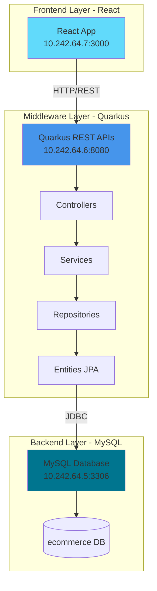
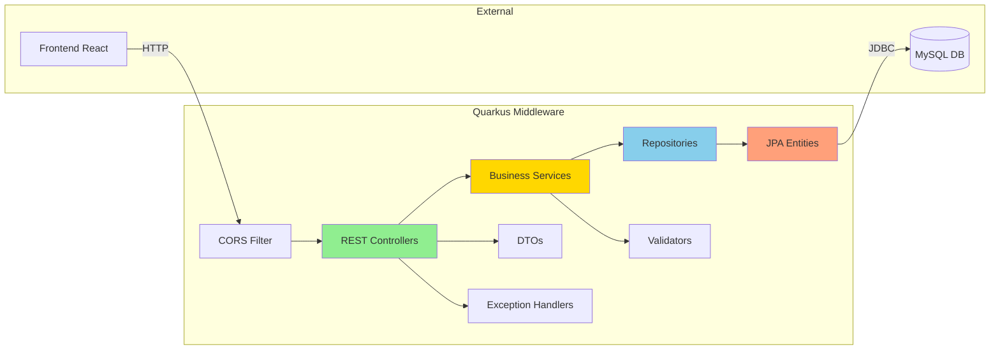
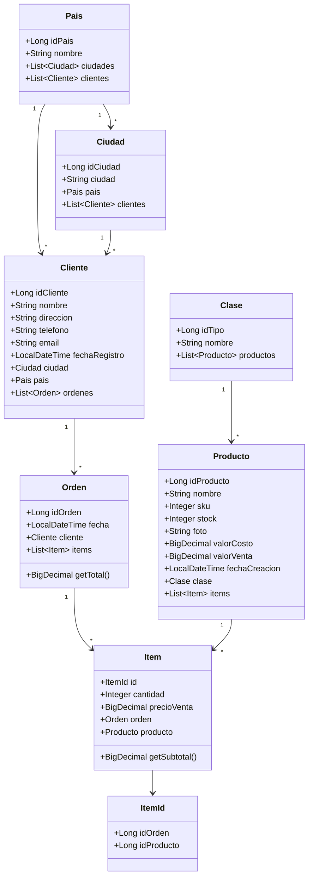
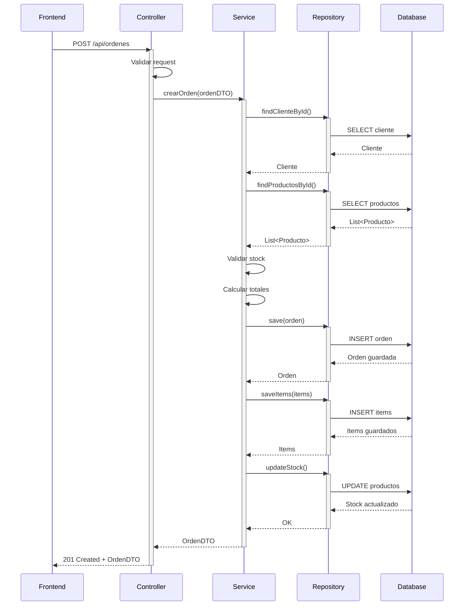

# Plan de Implementación - Middleware Quarkus E-commerce
## Parte 2: APIs REST con Quarkus

### 📋 Información del Servidor
- **IP**: 10.242.64.6
- **SO**: Red Hat Enterprise Linux 9
- **Framework**: Quarkus (última versión estable)
- **Java**: OpenJDK (última versión LTS desde repositorios Red Hat)
- **Puerto**: 8080 (HTTP)
- **Acceso**: SSH con usuario sudo

---

## 🏗️ Arquitectura de 3 Capas



---

## 📊 Diagrama de Componentes



---

## 🎯 Diagrama de Clases UML



---

## 🔄 Diagrama de Secuencia - Crear Orden



---

## 📡 Endpoints de la API REST

### 1. Países

| Método | Endpoint | Descripción | Request | Response |
|--------|----------|-------------|---------|----------|
| GET | `/api/paises` | Listar todos los países | - | `List<PaisDTO>` |
| GET | `/api/paises/{id}` | Obtener país por ID | - | `PaisDTO` |
| POST | `/api/paises` | Crear nuevo país | `PaisDTO` | `PaisDTO` |
| PUT | `/api/paises/{id}` | Actualizar país | `PaisDTO` | `PaisDTO` |
| DELETE | `/api/paises/{id}` | Eliminar país | - | `204 No Content` |

### 2. Ciudades

| Método | Endpoint | Descripción | Request | Response |
|--------|----------|-------------|---------|----------|
| GET | `/api/ciudades` | Listar todas las ciudades | - | `List<CiudadDTO>` |
| GET | `/api/ciudades/{id}` | Obtener ciudad por ID | - | `CiudadDTO` |
| GET | `/api/ciudades/pais/{idPais}` | Ciudades por país | - | `List<CiudadDTO>` |
| POST | `/api/ciudades` | Crear nueva ciudad | `CiudadDTO` | `CiudadDTO` |
| PUT | `/api/ciudades/{id}` | Actualizar ciudad | `CiudadDTO` | `CiudadDTO` |
| DELETE | `/api/ciudades/{id}` | Eliminar ciudad | - | `204 No Content` |

### 3. Clientes

| Método | Endpoint | Descripción | Request | Response |
|--------|----------|-------------|---------|----------|
| GET | `/api/clientes` | Listar todos los clientes | - | `List<ClienteDTO>` |
| GET | `/api/clientes/{id}` | Obtener cliente por ID | - | `ClienteDTO` |
| GET | `/api/clientes/email/{email}` | Buscar por email | - | `ClienteDTO` |
| GET | `/api/clientes/pais/{idPais}` | Clientes por país | - | `List<ClienteDTO>` |
| POST | `/api/clientes` | Crear nuevo cliente | `ClienteDTO` | `ClienteDTO` |
| PUT | `/api/clientes/{id}` | Actualizar cliente | `ClienteDTO` | `ClienteDTO` |
| DELETE | `/api/clientes/{id}` | Eliminar cliente | - | `204 No Content` |

### 4. Clases (Categorías)

| Método | Endpoint | Descripción | Request | Response |
|--------|----------|-------------|---------|----------|
| GET | `/api/clases` | Listar todas las clases | - | `List<ClaseDTO>` |
| GET | `/api/clases/{id}` | Obtener clase por ID | - | `ClaseDTO` |
| POST | `/api/clases` | Crear nueva clase | `ClaseDTO` | `ClaseDTO` |
| PUT | `/api/clases/{id}` | Actualizar clase | `ClaseDTO` | `ClaseDTO` |
| DELETE | `/api/clases/{id}` | Eliminar clase | - | `204 No Content` |

### 5. Productos

| Método | Endpoint | Descripción | Request | Response |
|--------|----------|-------------|---------|----------|
| GET | `/api/productos` | Listar todos los productos | - | `List<ProductoDTO>` |
| GET | `/api/productos/{id}` | Obtener producto por ID | - | `ProductoDTO` |
| GET | `/api/productos/sku/{sku}` | Buscar por SKU | - | `ProductoDTO` |
| GET | `/api/productos/clase/{idTipo}` | Productos por categoría | - | `List<ProductoDTO>` |
| GET | `/api/productos/disponibles` | Productos con stock | - | `List<ProductoDTO>` |
| POST | `/api/productos` | Crear nuevo producto | `ProductoDTO` | `ProductoDTO` |
| PUT | `/api/productos/{id}` | Actualizar producto | `ProductoDTO` | `ProductoDTO` |
| PATCH | `/api/productos/{id}/stock` | Actualizar stock | `StockDTO` | `ProductoDTO` |
| DELETE | `/api/productos/{id}` | Eliminar producto | - | `204 No Content` |

### 6. Órdenes

| Método | Endpoint | Descripción | Request | Response |
|--------|----------|-------------|---------|----------|
| GET | `/api/ordenes` | Listar todas las órdenes | - | `List<OrdenDTO>` |
| GET | `/api/ordenes/{id}` | Obtener orden por ID | - | `OrdenDTO` |
| GET | `/api/ordenes/cliente/{idCliente}` | Órdenes por cliente | - | `List<OrdenDTO>` |
| GET | `/api/ordenes/{id}/items` | Items de una orden | - | `List<ItemDTO>` |
| POST | `/api/ordenes` | Crear nueva orden | `CrearOrdenDTO` | `OrdenDTO` |
| DELETE | `/api/ordenes/{id}` | Eliminar orden | - | `204 No Content` |

### 7. Items

| Método | Endpoint | Descripción | Request | Response |
|--------|----------|-------------|---------|----------|
| POST | `/api/ordenes/{idOrden}/items` | Agregar item a orden | `ItemDTO` | `ItemDTO` |
| DELETE | `/api/ordenes/{idOrden}/items/{idProducto}` | Eliminar item | - | `204 No Content` |

---

## 📦 Estructura del Proyecto Quarkus

```
ecommerce-api/
├── src/
│   ├── main/
│   │   ├── java/
│   │   │   └── com/
│   │   │       └── ecommerce/
│   │   │           ├── entity/
│   │   │           │   ├── Pais.java
│   │   │           │   ├── Ciudad.java
│   │   │           │   ├── Cliente.java
│   │   │           │   ├── Clase.java
│   │   │           │   ├── Producto.java
│   │   │           │   ├── Orden.java
│   │   │           │   ├── Item.java
│   │   │           │   └── ItemId.java
│   │   │           ├── dto/
│   │   │           │   ├── PaisDTO.java
│   │   │           │   ├── CiudadDTO.java
│   │   │           │   ├── ClienteDTO.java
│   │   │           │   ├── ClaseDTO.java
│   │   │           │   ├── ProductoDTO.java
│   │   │           │   ├── OrdenDTO.java
│   │   │           │   ├── ItemDTO.java
│   │   │           │   ├── CrearOrdenDTO.java
│   │   │           │   └── ErrorResponse.java
│   │   │           ├── repository/
│   │   │           │   ├── PaisRepository.java
│   │   │           │   ├── CiudadRepository.java
│   │   │           │   ├── ClienteRepository.java
│   │   │           │   ├── ClaseRepository.java
│   │   │           │   ├── ProductoRepository.java
│   │   │           │   ├── OrdenRepository.java
│   │   │           │   └── ItemRepository.java
│   │   │           ├── service/
│   │   │           │   ├── PaisService.java
│   │   │           │   ├── CiudadService.java
│   │   │           │   ├── ClienteService.java
│   │   │           │   ├── ClaseService.java
│   │   │           │   ├── ProductoService.java
│   │   │           │   └── OrdenService.java
│   │   │           ├── resource/
│   │   │           │   ├── PaisResource.java
│   │   │           │   ├── CiudadResource.java
│   │   │           │   ├── ClienteResource.java
│   │   │           │   ├── ClaseResource.java
│   │   │           │   ├── ProductoResource.java
│   │   │           │   └── OrdenResource.java
│   │   │           ├── mapper/
│   │   │           │   ├── PaisMapper.java
│   │   │           │   ├── CiudadMapper.java
│   │   │           │   ├── ClienteMapper.java
│   │   │           │   ├── ClaseMapper.java
│   │   │           │   ├── ProductoMapper.java
│   │   │           │   └── OrdenMapper.java
│   │   │           ├── exception/
│   │   │           │   ├── ResourceNotFoundException.java
│   │   │           │   ├── BusinessException.java
│   │   │           │   └── GlobalExceptionHandler.java
│   │   │           └── config/
│   │   │               └── CorsConfig.java
│   │   └── resources/
│   │       ├── application.properties
│   │       └── import.sql
│   └── test/
│       └── java/
│           └── com/
│               └── ecommerce/
│                   └── resource/
│                       ├── PaisResourceTest.java
│                       ├── ClienteResourceTest.java
│                       └── ProductoResourceTest.java
├── pom.xml
└── README.md
```

---

## 🔧 Tecnologías y Dependencias

### Core
- **Quarkus**: 3.x (última versión estable)
- **Java**: OpenJDK 17 LTS
- **Maven**: 3.8+

### Extensiones Quarkus
- `quarkus-hibernate-orm-panache` - ORM simplificado
- `quarkus-jdbc-mysql` - Driver MySQL
- `quarkus-resteasy-reactive-jackson` - REST + JSON
- `quarkus-smallrye-openapi` - Documentación API
- `quarkus-hibernate-validator` - Validaciones
- `quarkus-smallrye-health` - Health checks
- `quarkus-micrometer-registry-prometheus` - Métricas

### Adicionales
- **MapStruct**: Mapeo de entidades a DTOs
- **Lombok**: Reducir boilerplate
- **JUnit 5**: Testing
- **RestAssured**: Testing de APIs

---

## 🔒 Configuración de Seguridad y CORS

### CORS Configuration
```java
@ApplicationScoped
public class CorsConfig {
    @ConfigProperty(name = "cors.origins")
    String allowedOrigins; // http://10.242.64.7:3000
    
    @ConfigProperty(name = "cors.methods")
    String allowedMethods; // GET,POST,PUT,DELETE,PATCH
}
```

### application.properties
```properties
# CORS
quarkus.http.cors=true
quarkus.http.cors.origins=http://10.242.64.7:3000
quarkus.http.cors.methods=GET,POST,PUT,DELETE,PATCH,OPTIONS
quarkus.http.cors.headers=accept,authorization,content-type,x-requested-with
quarkus.http.cors.exposed-headers=Content-Disposition
quarkus.http.cors.access-control-max-age=24H
```

---

## 📝 Validaciones de Negocio

### Cliente
- Email único y formato válido
- País y ciudad deben existir
- Teléfono formato válido

### Producto
- SKU único
- Stock no negativo
- Precios positivos
- Clase debe existir

### Orden
- Cliente debe existir
- Al menos un item
- Productos deben tener stock suficiente
- Precios deben coincidir con productos actuales

---

## 🧪 Testing

### Unit Tests
- Servicios con mocks
- Validaciones de negocio
- Mappers

### Integration Tests
- APIs REST completas
- Conexión a base de datos de prueba
- Transacciones

### Test Coverage
- Mínimo 80% de cobertura
- Casos de éxito y error
- Validaciones de constraints

---

## 📊 Monitoreo y Observabilidad

### Health Checks
- `/q/health` - Estado general
- `/q/health/live` - Liveness
- `/q/health/ready` - Readiness

### Métricas
- `/q/metrics` - Métricas Prometheus
- Tiempo de respuesta de APIs
- Conexiones a base de datos
- Errores y excepciones

### Logging
- Nivel configurable por ambiente
- Logs estructurados (JSON)
- Correlación de requests

---

## 🚀 Despliegue

### Desarrollo
```bash
./mvnw quarkus:dev
```

### Producción
```bash
./mvnw package
java -jar target/quarkus-app/quarkus-run.jar
```

### Docker (Opcional)
```bash
./mvnw package -Dquarkus.container-image.build=true
docker run -p 8080:8080 ecommerce-api:1.0.0
```

---

## 📈 Performance

### Optimizaciones
- Lazy loading de relaciones
- Paginación en listados
- Cache de consultas frecuentes
- Connection pooling
- Índices en base de datos

### Objetivos
- Tiempo de respuesta < 200ms (p95)
- Throughput > 1000 req/s
- Disponibilidad > 99.9%

---

## 🔄 Próximos Pasos

### Parte 3: Frontend React
- Interfaz de usuario
- Integración con APIs
- Carrito de compras
- Gestión de órdenes
- Panel de administración

---

**Versión**: 2.0.0  
**Estado**: 🚧 En Desarrollo  
**Última actualización**: 2026-06-03